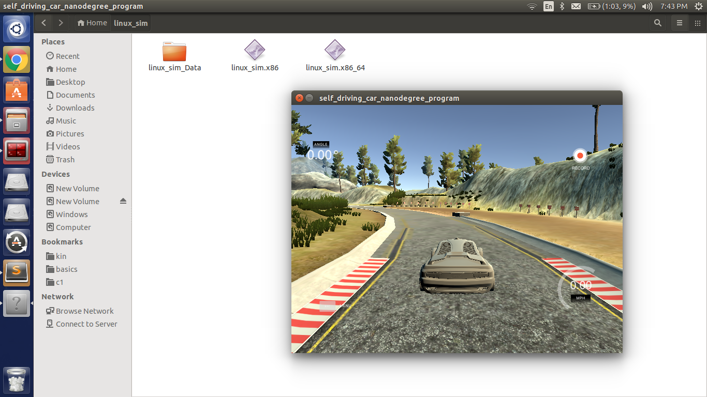
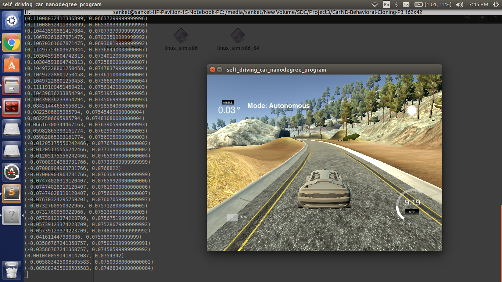

# Behaviorial Cloning Project

[](http://www.udacity.com/drive)
#**Behavioral Cloning** 


[//]: # (Image References)

[image1]: ./examples/placeholder.png "Model Visualization"
[image2]: ./examples/placeholder.png "Grayscaling"
[image3]: ./examples/placeholder_small.png "Recovery Image"
[image4]: ./examples/placeholder_small.png "Recovery Image"
[image5]: ./examples/placeholder_small.png "Recovery Image"
[image6]: ./examples/placeholder_small.png "Normal Image"
[image7]: ./examples/placeholder_small.png "Flipped Image"

My project includes the following files:
* model.py containing the script to create and train the model
* drive.py for driving the car in autonomous mode
* model.h5 containing a trained convolution neural network 
* writeup_report.md or writeup_report.pdf summarizing the results

####2. Submission includes functional code
Using the Udacity provided simulator and my drive.py file, the car can be driven autonomously around the track by executing 
```sh
python drive.py model.h5
```

####3. Submission code is usable and readable

The model.py file contains the code for training and saving the convolution neural network. The file shows the pipeline I used for training and validating the model, and it contains comments to explain how the code works.

**Model Architecture and Training Strategy**

####1. An appropriate model architecture has been employed


I started with using single hidden layer approach explained in the course, but as it wasn't able to drive efficiently, I later used the Nvidia model explained in the lecture, I used a correction of 0.25 for left and right images sterring angles and also fliped the images for augmentations.  

My model is as follows:

```
Layer                                                           Output Shape                                   
====================================================================================
Lambda  (Norrmalize the image)                                  (None, 160, 320, 3)                           
_____________________________________________________________________________________
Cropping2D (Crops the image)                                    (None, 90, 320, 3)                                
_____________________________________________________________________________________
Convolution2D (24,5,5, sampling--> (2,2), activation --> relu ) (None, 43, 158, 24)                  
_____________________________________________________________________________________
Convolution2D (36,5,5, sampling--> (2,2), activation --> relu ) (None, 20, 77, 36)               
_____________________________________________________________________________________
Convolution2D (46,5,5, sampling--> (2,2), activation --> relu ) (None, 8, 37, 48)              
_____________________________________________________________________________________
Convolution2D (64,3,3, activation --> relu )                    (None, 6, 35, 64)       
_____________________________________________________________________________________
Convolution2D (64,3,3, activation --> relu )                    (None, 4, 33, 64)                 
_____________________________________________________________________________________
Flatten                                                         (None, 8448)              
_____________________________________________________________________________________
Dropout (0.5)                                                                  
_____________________________________________________________________________________
Dense                                                           (None, 100)                           
_____________________________________________________________________________________
Dropout (0.3)                                                                
_____________________________________________________________________________________
Dense                                                           (None, 50)          
_____________________________________________________________________________________
Dropout (0.2)                                                                  
_____________________________________________________________________________________
Dense                                                           (None, 10)                              
_____________________________________________________________________________________
Dense                                                           (None, 1)                =====================================================================================


```


**2. Attempts to reduce overfitting in the model **

I used dropout with low probability to reduce overfitting and also I trained for appropriate epoch where validation and training losses were taken into account to determine if the model overfitted or not.
  
The model was trained and validated on different data sets to ensure that the model was not overfitting (code line 18), here I used sklearn train test split to sperate 20% validation data and trained the model on 80% of the data. The validation score was taken into acount to determine if the model was overfitted or not. The model was tested by running it through the simulator and ensuring that the vehicle could stay on the track.

####3. Model parameter tuning

The model used an adam optimizer, so the learning rate was not tuned manually (model.py line 87).

**4. Appropriate training data**

Training data was chosen to keep the vehicle driving on the road. I used a combination of center lane driving, recovering from the left and right sides of the road.
I used left and right camera images and used a correction of 0.25 to the sterring angle and fliped this images with negating the steering angle to produce more data from a single lap. It used to produce 6 times more images compared to non-augmenting.  

1.) I trained it for 5 laps where 3 laps were clockwise, 1 in anticlockwise and 1 in another challenge envoironment, I guessed with so much data the car will be perfectly trained, but I didn't get the expected results, the model was obviously overfitted.

2.) I removed all the data trained it for 1 lap clockwise and 1 lap anticlockwise, but still was not getting expected results.

3.) Collected data from challenge environment but with precise driving which was very hard, had to do couples of time to get the perfect data, but the efforts did workout the car was showing improved results for turning, but still was going out for some big turns

4.) Collected data in seperate folder only for difficult turns in the route by going through them 2 times, also collected data if the vechiles has to return to the center of the road if its off-road. I just loaded the previous model and trained again using the same weights for 2 epochs (fine-tuning) and Kudos everthing worked. 


Center camera


left Camera


Right Camera


Flipped Center Image


For details about how I created the training data, see the next section. 

**Model Architecture and Training Strategy**

####1. Solution Design Approach

The overall strategy for deriving a model architecture was to avoid overfitting and getting accurate changes in steering angles for the car to stay on track.

First I just used a simple DNN with 1 hidden layers, trained fast but perfomed very poorly in the simulator.

Then I used convolution neural network model similar to Nvidia architecture introduced in the lecture. I thought this model might be appropriate because it was already tested in real world data and was different than the LeNet architecure, So I was curious to try it out.

In order to gauge how well the model was working, I split my image and steering angle data into a training and validation set (80%,20%). I found that my first model with epoch 10 had a low mean squared error on the training set but a high mean squared error on the validation set. This implied that the model was overfitting. So I plotted the training and validation error and reduced the epoch to 3 to observe that validation and training score had less difference, so the model will not overfit.   

To combat the overfitting, I reduced the number of epoch to 3 and for turning data to 2.

The final step was to run the simulator to see how well the car was driving around track one. There were a few spots where the vehicle fell off the track on sharp turns, to improve the driving behavior in these cases, I finetuned the model only for sharp turn scenarios by using specific relevant data and trained it for 2 epoch.

At the end of the process, the vehicle is able to drive autonomously around the track without leaving the road.

####2. Final Model Architecture

The final model architecture (model.py lines 75-89) consisted of a convolution neural network with the following layers and layer sizes 

```
Layer                                                           Output Shape                                   
====================================================================================
Lambda  (Norrmalize the image)                                  (None, 160, 320, 3)                           
_____________________________________________________________________________________
Cropping2D (Crops the image)                                    (None, 90, 320, 3)                                
_____________________________________________________________________________________
Convolution2D (24,5,5, sampling--> (2,2), activation --> relu ) (None, 43, 158, 24)                  
_____________________________________________________________________________________
Convolution2D (36,5,5, sampling--> (2,2), activation --> relu ) (None, 20, 77, 36)               
_____________________________________________________________________________________
Convolution2D (46,5,5, sampling--> (2,2), activation --> relu ) (None, 8, 37, 48)              
_____________________________________________________________________________________
Convolution2D (64,3,3, activation --> relu )                    (None, 6, 35, 64)       
_____________________________________________________________________________________
Convolution2D (64,3,3, activation --> relu )                    (None, 4, 33, 64)                 
_____________________________________________________________________________________
Flatten                                                         (None, 8448)              
_____________________________________________________________________________________
Dropout (0.5)                                                                  
_____________________________________________________________________________________
Dense                                                           (None, 100)                           
_____________________________________________________________________________________
Dropout (0.3)                                                                
_____________________________________________________________________________________
Dense                                                           (None, 50)          
_____________________________________________________________________________________
Dropout (0.2)                                                                  
_____________________________________________________________________________________
Dense                                                           (None, 10)                              
_____________________________________________________________________________________
Dense                                                           (None, 1)                =====================================================================================

```


####3. Creation of the Training Set & Training Process



To capture the training data set, I collected the data from simulator by playing manually by operating the steering with mouse.

I used left and right camera images and used a correction of 0.25 to the sterring angle and fliped this images with negating the steering angle to produce more data from a single lap. It used to produce 6 times more images compared to non-augmenting.  

1.) I trained it for 5 laps where 3 laps were clockwise, 1 in anticlockwise and 1 in another challenge envoironment, I guessed with so much data the car will be perfectly trained, but I didn't get the expected results, the model was obviously overfitted.

2.) I removed all the data trained it for 1 lap clockwise and 1 lap anticlockwise, but still was not getting expected results.

3.) Collected data from challenge environment but with precise driving which was very hard, had to do couples of time to get the perfect data, but the efforts did workout the car was showing improved results for turning, but still was going out for some big turns

4.) Collected data in seperate folder only for difficult turns in the route by going through them 2 times, also collected data if the vechiles has to return to the center of the road if its off-road. I just loaded the previous model and trained again using the same weights for 2 epochs (fine-tuning) and Kudos everthing worked. 




I finally randomly shuffled the data set and put 20% of the data into a validation set. 

I used this training data for training the model. The validation set helped determine if the model was over or under fitting. The ideal number of epochs was 3 and as I used an adam optimizer so that manually training the learning rate wasn't necessary.

